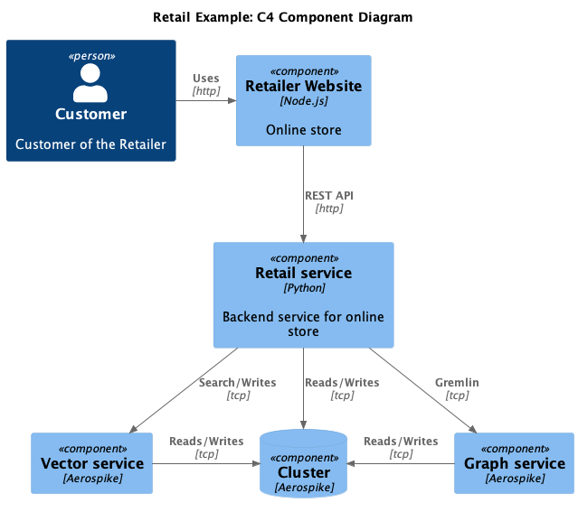

# Retail Demo Architecture

This document provides an overview of the architecture for the retail demo application. The architecture is illustrated using the following C4 diagrams.

## Component Interaction
The component interaction diagram shows the detailed interactions between different components of the system, highlighting the communication protocols and data exchange mechanisms.

## Deployment Architecture
The deployment architecture diagram depicts how the application is deployed on a local maching using Docker and Docker Compose.

